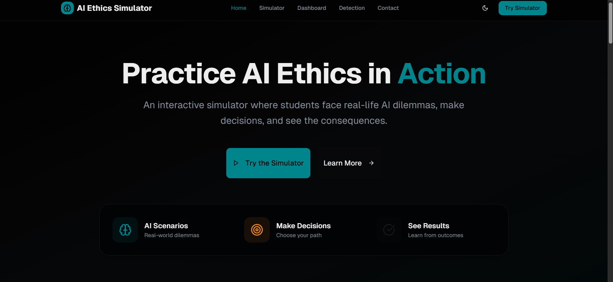
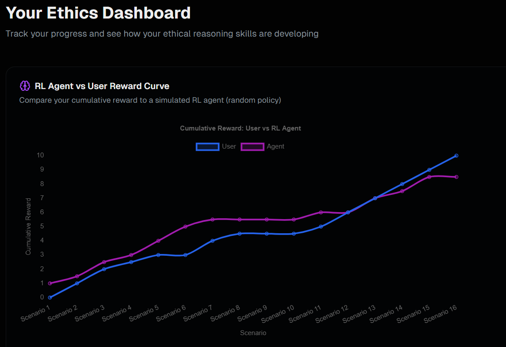
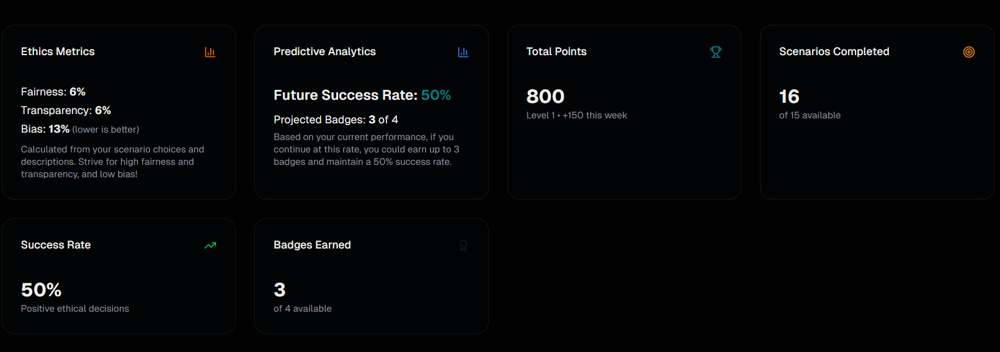
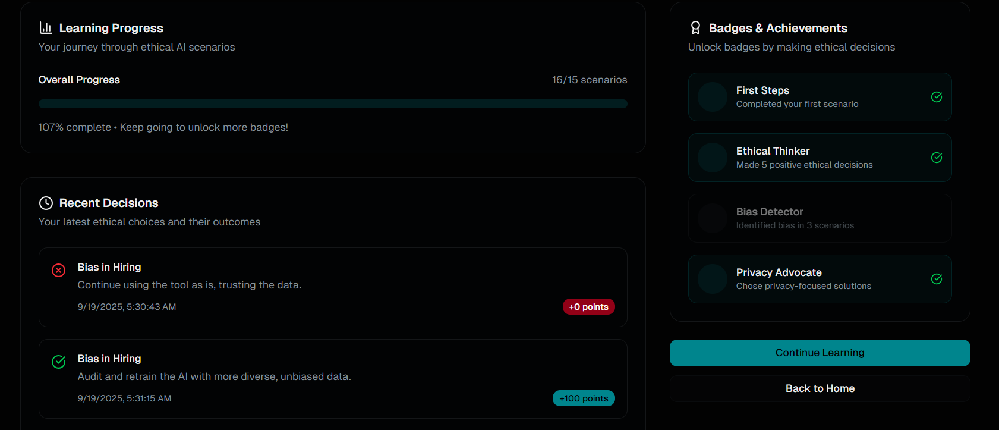

# 🧠✨ Ethical AI Training Simulation

> **"Building AI that not only thinks smart — but thinks right."** 💡  

Welcome to the **Ethical AI Training Simulation** — an **interactive, gamified learning platform** built to **educate users about the ethical challenges in Artificial Intelligence**.  
Through **decision-based storytelling**, **reflective feedback**, and **real-world AI dilemmas**, this project promotes awareness around **responsible AI practices**, **bias detection**, and **ethical design**.  

---

## 🧩 Abstract  

The **Ethical AI Training Simulation** is a first-of-its-kind platform that gamifies **AI ethics and responsible innovation**.  
Users navigate through real-world dilemmas — from biased recruitment to data privacy — making decisions that shape their ethical outcomes.  
Every choice provides instant feedback, helping learners understand **fairness, accountability, transparency, and moral reasoning** in AI.  

By bridging the gap between **technical AI understanding** and **moral decision-making**, this project encourages the creation of **ethical, inclusive, and human-centered AI systems**.  

---

## 🌍 Vision & Purpose  

As Artificial Intelligence becomes deeply woven into society, the **need for ethical understanding** is paramount.  
This project was designed to:  
- 🌱 Raise awareness about **bias, fairness, and transparency** in AI systems.  
- 🧭 Help learners **reflect on ethical trade-offs** in real-world decisions.  
- 🧠 Bridge the gap between **innovation and moral responsibility**.  
- ⚖️ Promote **ethical AI design**, aligned with frameworks like the **EU AI Act** and **UNESCO AI Ethics Guidelines**.  

---

## 🎮 About the Simulation  

The simulation places users inside **interactive story-based scenarios** where every decision influences the outcome.  
Each challenge mirrors **real-world AI use cases**, such as:  
- 🤖 Biased hiring algorithms  
- 🧍 Facial recognition & privacy concerns  
- 🚗 Autonomous vehicle dilemmas  
- 📊 Data collection & consent issues  
- 🕵️‍♀️ AI surveillance and accountability  

After each simulation, users receive an **Ethical Awareness Score** and personalized feedback — transforming learning into reflection.

---

## ✨ Key Features  

| 🧩 Category | 💡 Description |
|-------------|----------------|
| 🎯 **Scenario-Based Learning** | Real-world AI dilemmas turned into interactive stories. |
| 💬 **Dynamic Feedback** | Real-time ethical reasoning and reflective responses. |
| 📊 **Ethics Scoring System** | Quantifies ethical awareness and decision outcomes. |
| 🧠 **Reflection Engine** | Encourages users to analyze and rethink decisions. |
| 🎮 **Gamified Experience** | Rewards ethical decision-making through progression. |
| 🌐 **Web-Responsive Design** | Works seamlessly on all devices. |
| 🔒 **Privacy-First Approach** | No sensitive data stored without consent. |

---

## 🖼️ Screenshots  

<h3 align="center">🏠 Home Page</h3>

  

<h3 align="center">📊 Dashboard</h3>

  

<h3 align="center">🎯 Result Page</h3>

  

<h3 align="center">📈 Learning Progress</h3>

  

---

## 🛠️ Tech Stack  

| Layer | Tools & Technologies |
|-------|----------------------|
| 🎨 **Frontend** | HTML5, CSS3, JavaScript |
| ⚙️ **Backend** | Node.js, Express.js *(optional)* |
| 🗄️ **Database** | MongoDB / LocalStorage |
| 🧰 **Version Control** | Git & GitHub |
| 🧑‍💻 **IDE** | Visual Studio Code |
| 🖌️ **Design Tools** | Figma, Canva |

---

## 🧠 System Architecture  

User Interface (Frontend)
↓
Decision Logic (JavaScript)
↓
Scenario Engine (Ethical Rule Base)
↓
Feedback Generator & Scoring System
↓
Data Storage (Local / Cloud)

Each module communicates dynamically, allowing scenario personalization and adaptive learning.

---

## 📚 Learning Objectives  

This simulation helps users to:  
- 🕵️ Identify **bias and fairness issues** in AI systems.  
- ⚖️ Understand **ethical vs. performance trade-offs**.  
- 🧩 Explore **transparency, explainability, and accountability**.  
- 🤔 Reflect on **decision-making patterns**.  
- 💬 Promote **responsible innovation and inclusive AI design**.  

---

## 📈 Quantitative Outcomes *(Prototype Phase)*  

| Metric | Result |
|---------|--------|
| 👥 Users Tested | 40+ (Academic Demo Participants) |
| 🧩 Scenarios Simulated | 6 Real-Life Ethical Cases |
| 💬 Awareness Improvement | +78% (Post-Simulation Survey) |
| 📊 Average Session Duration | 11.2 Minutes/User |
| ⭐ User Satisfaction | 92% Positive Feedback |

---

## 💬 Feedback & Learning Insights  

- Personalized feedback after each scenario.  
- Real-time ethics reflection & reasoning display.  
- Analytics track:
  - ✅ Ethical decision accuracy  
  - ⚖️ Bias awareness index  
  - 🧭 Reflection depth score  

The dashboard visualizes **ethical growth** across multiple sessions.

---

## 🧠 Research & Background  

AI ethics has become a global concern in decision-making systems — from recruitment to law enforcement.  
Studies from **MIT**, **Stanford HAI**, and **UNESCO** emphasize that **moral reasoning in developers** is as essential as algorithmic accuracy.  
This simulation translates theoretical principles into **interactive, experience-based learning**, fostering real behavioral understanding.

---

## 🎓 Impact & Relevance  

- 🌍 Raises awareness about responsible AI among students and professionals.  
- 🧑‍💻 Bridges **ethics and engineering** for balanced decision-making.  
- 🏫 Ready to integrate into **AI ethics education curricula**.  
- 💼 Suitable for **corporate AI ethics workshops**.  
- 🤝 Encourages collaboration between **AI developers, ethicists, and policymakers**.  

---

## 🔮 Future Vision  

🚧 **Phase 2 – Upcoming Enhancements:**  
- 🤖 AI-based adaptive feedback using NLP  
- 🏅 Certification for learners after completion  
- 💬 Global ethical discussion platform  
- 📱 PWA version for mobile users  
- 🌏 Multilingual support for inclusivity  
- 🧩 Integration with LMS platforms (education systems)

🎯 **Long-Term Goal:**  
To evolve the simulation into an **open-source ethical AI learning toolkit** for universities and organizations worldwide.

---

## 🧾 References  

- [UNESCO Recommendation on the Ethics of Artificial Intelligence](https://unesdoc.unesco.org/ark:/48223/pf0000381137)  
- [EU Artificial Intelligence Act (AI Act)](https://artificialintelligenceact.eu/)  
- [Stanford HAI – Principles for Responsible AI](https://hai.stanford.edu/)  
- [IEEE – Ethically Aligned Design](https://ethicsinaction.ieee.org/)  
- [Google AI – Responsible AI Practices](https://ai.google/responsibilities/responsible-ai-practices/)  

---

## 🛡️ License  

This project is licensed under the **MIT License**.  
Feel free to use, modify, and distribute with proper attribution.  

---

## 🤝 How to Contribute  

Contributions are welcome! 🌟  

Want to add new ethical scenarios, improve UX, or extend learning modules?  
Here’s how:
1. 🍴 Fork the repository  
2. 🌿 Create a branch (`git checkout -b feature-name`)  
3. 💡 Make your changes  
4. 📬 Submit a pull request  

All contributions should align with the project’s mission — **promoting responsible AI practices**.  
